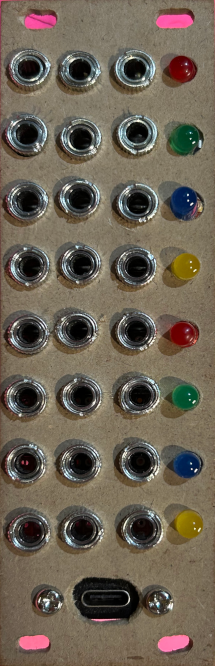

# MIDI2CV

just some musing on midi to cv (control voltage) converter for eurorack.

a simple circuit pi script.

make sure you have these libraries:

[adafruit_bus_device](https://github.com/adafruit/Adafruit_CircuitPython_BusDevice)

[adafruit_mcp4728.mpy](https://github.com/adafruit/Adafruit_MCP4728)

[adafruit_midi](https://github.com/adafruit/Adafruit_CircuitPython_MIDI)

---

made with 🖤 in NYC
